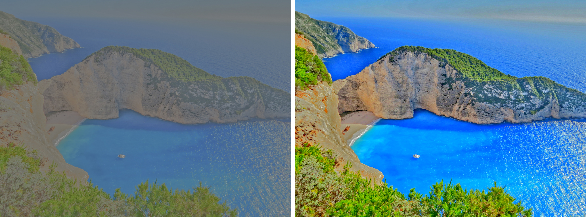

# AutoContrastOfImagesWithOpenMP

## About
The program increases the contrast of a dim image. That is, it stretches the range to [0; 255]. At the same time, you can specify a special coefficient - the proportion of the brightest/dimest pixels that will be ignored by the algorithm (to avoid a situation where, due to one pixel accidentally caught on the picture, the picture did not change)

The program supports image types such as *.pgm (P5) and *.ppm (P6)

## Compile and run
To run the program, compile the code (you can use my CMakeList.txt for the GCC compiler). Then run the program using
> prog_name.exe < count threads > < path to input image > < path to output image > < coefficient >

## Realization with OpenMP

The program works with elements of parallel programming (the OpenMP 2.0 standard is used (link on documentation: https://www.openmp.org/wp-content/uploads/cspec20.pdf)), which significantly reduces the processing time of the photo

But reading the file at this stage of development could not be done in parallel, so reading/writing files may take some time

## About algorithm

To search for the brightest/dimest pixel, taking into account the coefficient, the search for the k-th ordinal statistics is used. Then, taking into account the data obtained, the transformation of each pixel value is performed according to some mathematical formula

## Example of the result

## More info

For more detailed information, you can read the report "Отчет.pdf" (only in Russian)

## Contacts

Telegram: @trofik00777

Email: maks.trofimov.0303@mail.ru
